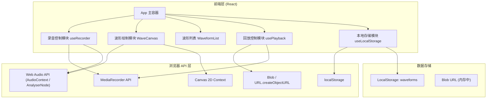
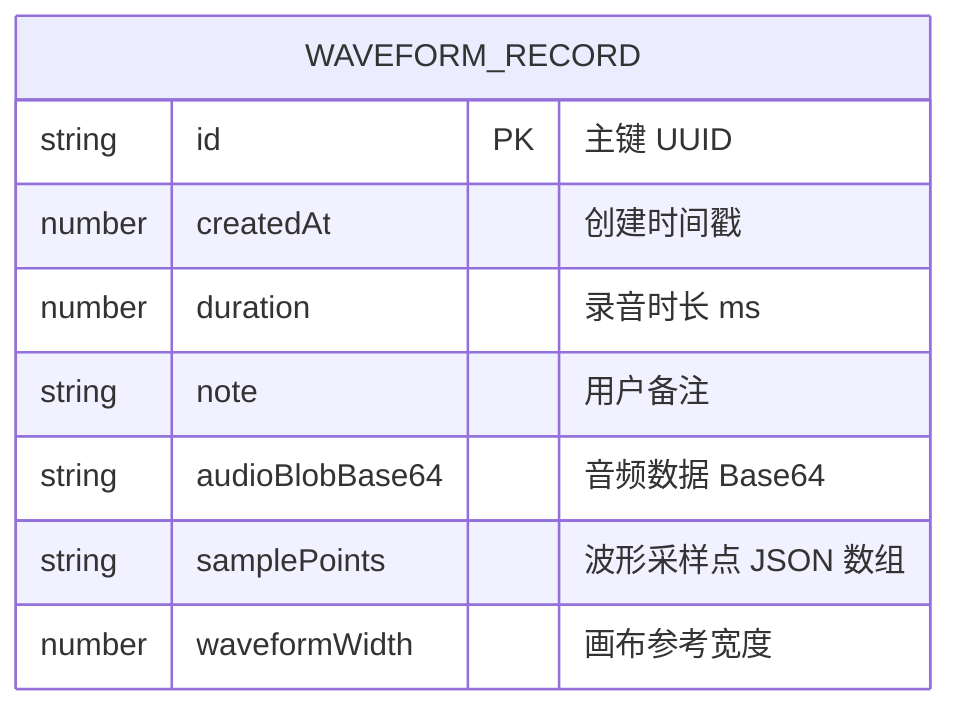

## 1. 架构设计



## 2. 技术选型说明

- **前端框架**：React@18 + Vite@5
- **样式方案**：TailwindCSS@3（快速构建暗色主题界面）+ 自定义 CSS 动画
- **录音能力**：`MediaRecorder API`（捕获麦克风音频流，生成 Blob）
- **音频分析**：`Web Audio API` + `AnalyserNode`（实时获取频域/时域数据用于绘图）
- **波形绘制**：`Canvas 2D API`（高性能实时绘制和固化波形渲染）
- **数据持久化**：`localStorage`（存储波形元数据、标注、音频 Base64 或 Blob URL 引用）
- **导出功能**：`Blob` + `URL.createObjectURL` + `<a download>` 触发下载

**说明**：
- 不使用后端服务，所有数据 100% 保存在用户浏览器本地
- 音频数据较大时将使用 Blob + IndexedDB 备选方案，优先使用 localStorage 存储元数据 + 压缩后的波形采样点

## 3. 路由定义

| 路由 | 用途 |
|------|------|
| `/` | 主页面，包含所有功能（单页应用，无路由跳转） |

## 4. 核心数据结构

```typescript
// 单条波形记录
interface WaveformRecord {
  id: string;           // UUID
  createdAt: number;    // 创建时间戳
  duration: number;     // 时长（毫秒）
  note: string;         // 用户备注
  audioBlobBase64: string;  // 音频 Blob 的 Base64 编码（含 MIME 前缀）
  samplePoints: number[];   // 采样的波形幅值数据 [-1, 1] 归一化，约 200-500 个点
  waveformWidth: number;    // 绘制时的画布宽度参考
}

// 应用全局状态
interface AppState {
  recordings: WaveformRecord[];
  isRecording: boolean;
  isPlaying: string | null;  // 当前正在回放的波形 ID
  selectedId: string | null;
}
```

## 5. 核心模块设计

### 5.1 useRecorder Hook
负责麦克风权限请求、录音控制、实时数据采集。
- `startRecording()`: 请求权限，启动 MediaRecorder 和 AnalyserNode
- `stopRecording()`: 停止录音，解析 Blob，提取采样点，生成完整 WaveformRecord
- `getLiveData()`: 返回当前帧的时域数据数组（用于实时绘制）
- 事件：`onProgress`（录音进度）、`onData`（实时波形帧）

### 5.2 WaveCanvas 组件
负责实时波形绘制和固化波形渲染。
- **实时模式**：滚动式绘制，AnalyserNode 数据逐帧追加，左移效果
- **固化模式**：根据 samplePoints 数组一次性绘制平滑曲线
- 样式：荧光描边、背景栅格、基准线

### 5.3 usePlayback Hook
负责波形点击后的音频回放和进度可视化。
- `play(id)`: 创建 Audio 对象或 Web Audio BufferSource，播放对应音频
- `stop()`: 停止当前播放
- 事件：`onPlaybackStart`、`onPlaybackEnd`、`onTimeUpdate`（进度）

### 5.4 useLocalStorage Hook
封装持久化逻辑。
- `loadRecordings()`: 从 localStorage 加载历史波形
- `saveRecordings(list)`: 保存到 localStorage
- `exportJSON()`: 将所有数据打包为 JSON 文件下载
- `importJSON(file)`: 从文件导入（可选扩展）

## 6. 数据模型图


