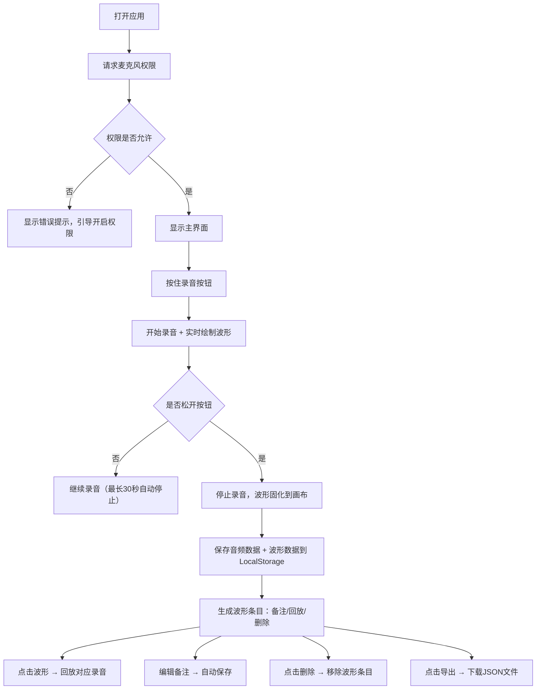

## 1. 产品概述
声音波形涂鸦是一款面向音乐创作者、声音爱好者的轻量级网页应用，用户可通过麦克风录制哼唱旋律，实时生成类似心电图的波形线条，并将多段波形并列展示，形成独特的"声音指纹"画布。

- 核心价值：将转瞬即逝的哼唱转化为可保存、可回放、可标注的视觉化波形，方便记录音乐灵感
- 目标用户：音乐创作人、词曲作者、声音爱好者、需要记录声音灵感的任何人

## 2. 核心特性

### 2.1 用户角色
本产品无需注册，所有用户均可直接使用。

| 角色 | 注册方式 | 核心权限 |
|------|----------|----------|
| 普通用户 | 无需注册 | 录制声音、生成波形、标注备注、回放、导出、删除 |

### 2.2 功能模块
1. **主画布区**：实时波形预览、已固化波形并列展示、波形交互操作
2. **录音控制区**：按住录音按钮、录音状态指示、实时计时器
3. **波形管理区**：单条波形标注备注、删除单条、批量导出

### 2.3 页面详情
| 页面名称 | 模块名称 | 功能描述 |
|----------|----------|----------|
| 主页面 | 录音按钮组件 | 按住录制、松开发布，支持录音时长限制（最长30秒），录音中显示脉冲动画和计时 |
| 主页面 | 实时波形画布 | 录音过程中以滚动方式显示实时采集的波形数据，动态流畅 |
| 主页面 | 已固化波形列表 | 多段波形从上到下并列展示，每条波形独占一行，类似心电图记录纸 |
| 主页面 | 波形条目组件 | 包含波形缩略图、备注输入框、回放按钮、删除按钮、时长显示 |
| 主页面 | 工具栏 | 一键导出全部波形数据（JSON格式）、清空全部、统计信息 |

## 3. 核心流程
用户打开应用后，首先请求麦克风权限。按住录音按钮开始录制，屏幕上实时显示滚动波形，松开按钮后波形固化到画布并生成一条记录。用户可点击波形回放录音，编辑备注标签，或删除/导出数据。

## 4. 界面设计

### 4.1 设计风格
**设计方向：深色质感 · 赛博医疗风**

- **主色调**：深空黑 `#0a0e17` 背景 + 荧光青绿 `#00ffcc` 波形线条
- **辅色调**：霓虹粉 `#ff2d95` 录音脉冲、琥珀黄 `#ffb347` 高亮选中
- **按钮风格**：圆润胶囊形，录音按钮为大圆形，内发光效果
- **字体**：`JetBrains Mono` 等宽字体（数值、计时）+ `Noto Sans SC` 中文显示
- **布局风格**：暗色卡片式，波形区域类似医疗监护仪屏幕，带扫描线效果
- **图标风格**：线性极简图标，带微光描边

### 4.2 页面设计概览
| 页面名称 | 模块名称 | UI 元素 |
|----------|----------|---------|
| 主页面 | 顶部标题栏 | Logo图标、应用名称「声纹涂鸦」、操作按钮组（导出/清空） |
|主页面 | 实时波形区 | 类似示波器的暗色背景，水平参考线，实时滚动的荧光波形，录音时底部显示红色REC标记和计时器 |
| 主页面 | 录音按钮区 | 居中大圆形录音按钮，按住时有涟漪扩散动画，周围显示操作提示文字 |
| 主页面 | 波形列表区 | 卡片式波形条目，每条有独立画布、备注输入框（点击编辑）、时长标签、回放/删除按钮，选中时边框高亮 |
| 主页面 | 空状态提示 | 无波形时显示引导插画和文字提示 |

### 4.3 响应式
- 桌面端优先设计，左侧工具栏 + 中央画布 + 右侧波形列表
- 移动端自适应为上下布局，按钮区固定在底部，波形列表可滚动
- 触摸优化：按钮最小尺寸 44x44px，支持长按录音

### 4.4 动效设计
- **录音中**：按钮脉冲涟漪扩散，波形区顶部扫描线循环滚动，REC标志闪烁
- **波形生成**：固化时波形从透明渐入，带滑入动画
- **回放时**：波形高亮并有播放进度指示线扫过
- **悬停交互**：按钮和波形卡片有轻微放大和发光效果
